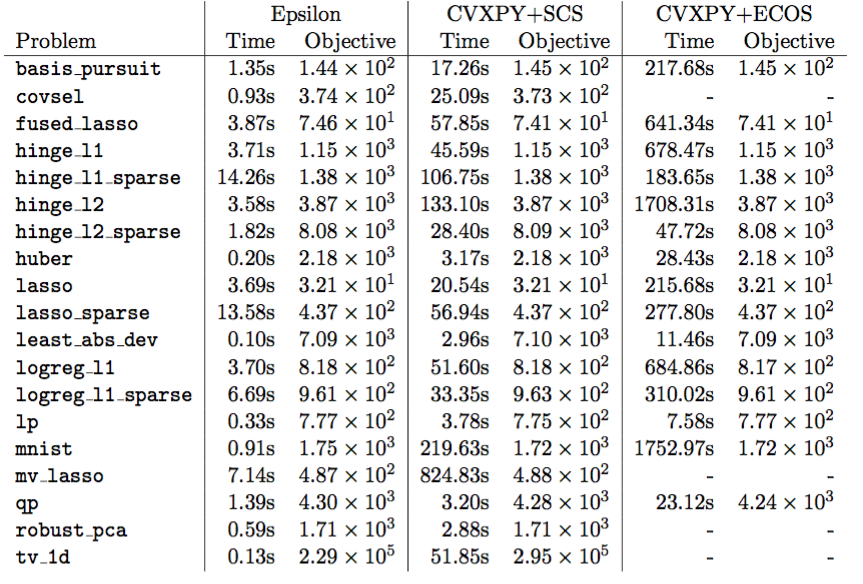

Benchmarks
==========

On a library of benchmarks from statistical machine learning
problems, we compare Epsilon to `ECOS <https://github.com/embotech/ecos>`_, an interior
point method and `SCS <https://github.com/cvxgrp/scs>`_, the splitting
conic solver. The exact definition of each benchmark is available as part of the
``epopt`` package, in ``epopt.problems`` (`github
<https://github.com/mwytock/epsilon/tree/master/python/epopt/problems>`_).

On each example, we run each solver to default tolerances which for Epsilon and
SCS correspond to moderate accuracy and high
accuracy for ECOS [#fn-ecos]_. In practice, we observe that all solvers converge to a relative
accuracy of :math:`10^{-2}` which is reasonable for the statistical applications under
consideration.

The running times show that on all problem examples considered, Epsilon is faster
than SCS and ECOS and often by a wide margin. In general, we observe that
Epsilon tends to solve problems in fewer ADMM iterations and for many problems
the iterations are faster due in part to operating on a smaller number of
variables.

.. rubric:: Footnotes

.. [#fn-ecos] Modifying the tolerances for an interior point method does not
	   materially affect the comparison due to the nature of the
	   bottlenecks.
