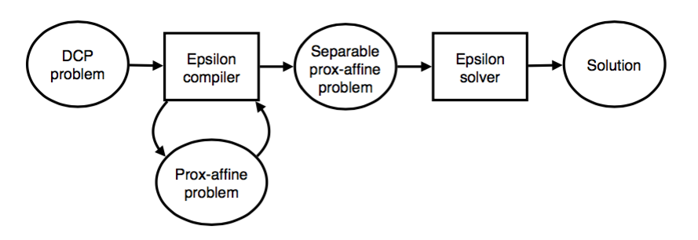
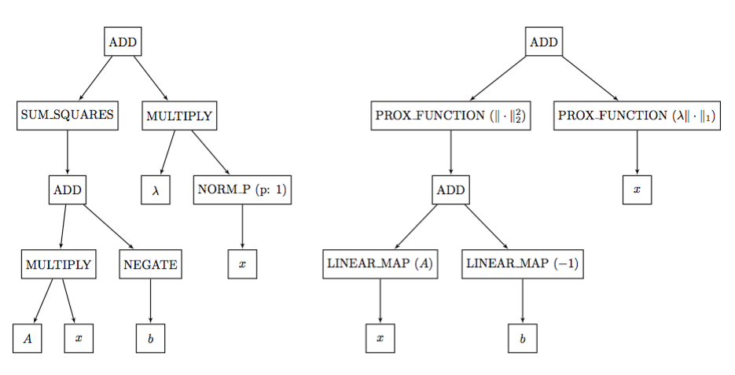

Epsilon Compiler
================

The main idea behind Epsilon is to reduce a general convex problem to a sum of
"prox-friendly" functions and employ a large library of fast proximal and linear
operator implementations to solve problems directly in this form.  We refer to
this intermediate representation the :ref:`prox-affine form <prox-affine-form>`,
and problems in this form can be directly mapped to a set of efficient proximal
and linear operators available to the solver.

Overview
--------

There are two main components of Epsilon: 1) the *compiler*, which
transforms a `DCP representation <http://www.cvxpy.org/en/latest/tutorial/dcp/>`_
into prox-affine form by manipulating the abstract syntax tree
(AST) corresponding to the original problem; and 2) the *solver*, which
solves the resulting problem using the fast implementation of these proximal and
linear operators.

.. _prox-affine-form:

Prox-affine form
----------------

The internal representation used by the compiler, as well as input to the
solver, is a convex problem in prox-affine form

.. math::

   \DeclareMathOperator{\minimize}{minimize} \minimize \;\; \sum_{i=1}^N
   f_i(H_i(x)),

..

consisting of the sum of "prox-friendly" functions :math:`f_1,\ldots,f_N`
composed with a set of affine transformations :math:`H_1,\ldots,H_N`. In
Epsilon, each :math:`f_i \circ H_i` is *atomic* meaning that it has a concrete
numerical routine in the solver which implements the proximal operator for this
function directly.

Conversion
----------

The first stage of the Epsilon compiler transforms an arbitrary disciplined
convex problem into a prox-affine problem. Concretely, given an AST representing
the optimization problem in its original form (which may consist of any valid
composition of functions from the DCP library), this stage produces an AST with
a reduced set of nodes:

- ``ADD``. The sum of its children.
- ``PROX_FUNCTION``. A prox-friendly function with proximal
  operator implementation in the Epsilon solver.
- ``LINEAR_MAP``. A linear function with linear operator
  implementation in the Epsilon solver.
- ``VARIABLE``, ``CONSTANT``. Each leaf of the AST is either a
  variable or constant.

An example of this transformation for the lasso problem is shown in the
following figure: the left side shows the input AST for the problem objective
composed with operations from the `DCP library
<http://www.cvxpy.org/en/latest/tutorial/functions/>`_ ; the right side shows
the AST after it has been transformed to prox-affine form.

Separation
----------

Once the problem has been put in prox-affine form, the next stage of the
compiler transforms it to be separable in preparation for the solver.
As a given problem typically has many different separable prox-affine
representations, this stage must balance the tradeoff between per-iteration
computational complexity and the overall number of iterations that will be
required to solve a given problem.

Epsilon follows the simple philosophy of minimizing the total number of
proximal operators in the separable form provided that each operator can be
evaluated efficiently.

For illustration purposes, consider the problem

.. math::

   \minimize \;\; \exp(\|x\|_2 + c^Tx) + \|x\|_1

..

The first compiler stage converts this problem to prox-affine form by introducing
auxiliary variables :math:`t,s,v`, along with three cone constraints and two
prox-friendly functions:

.. math::

   \minimize \;\; \exp(t) + \|x\|_1 + I_{\mathcal{Q}}(x,s) + I_0(s +
   c^Tx - t - v) + I_+(v),

..

where :math:`I_\mathcal{Q}` denotes the indicator of the second-order cone, :math:`I_0`
the zero cone and :math:`I_+` the nonnegative orthant. The problem in this form is the
input for the second stage which constructs the bipartite graph.

   .. image:: _static/graph_exp.png
      :height: 183px
      :align: center

The problem is then transformed to have separable objective with many of the
terms in :math:`I_0` (those with simple linear maps) moved to the constraint

.. math::

   \DeclareMathOperator{\subjectto}{subject\;to}
   \begin{split}
   \minimize \;\; & \exp(t) + \|x_1\|_1 +
   I_{\mathcal{Q}}(x_2,s) + I_0(c^Tx_3 - z) + I_+(v) \\
   \subjectto \;\; & s + z - t - v = 0 \\
   & x_1 = x_2 \\
   & x_2 = x_3
   \end{split}

..

and variables :math:`x_1, x_2, x_3` are introduced along with consensus
constraints. This problem is now has *separable* objective and is ready for
input to the solver, this property is easy to deduce from the bipartite graph:

   .. image:: _static/graph_exp_conv.png
      :height: 234px
      :align: center
