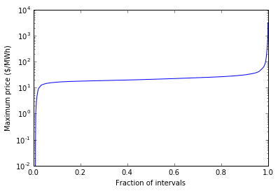
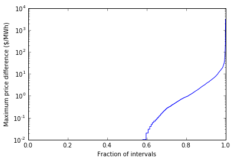
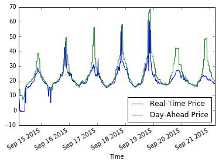
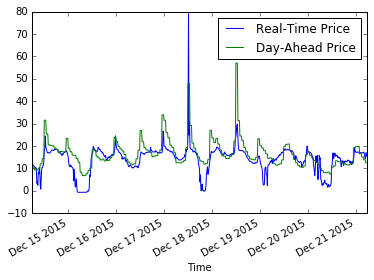
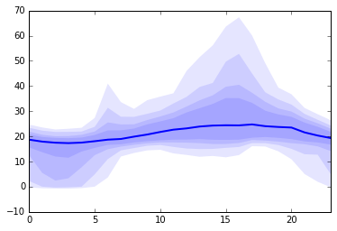
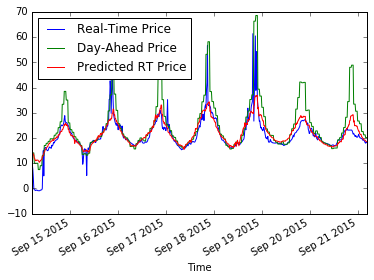
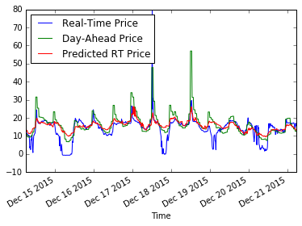
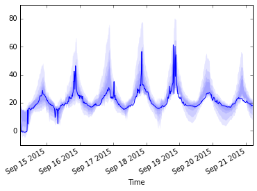
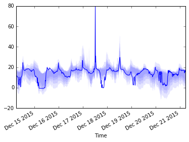
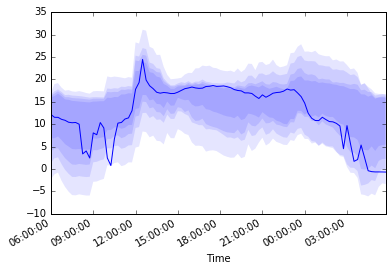

Forecasting electricity prices with multiple quantile regression
================================================================

In this example, we explore statistical modeling of electricity prices
in the wholesale electricity market, applying a probabilistic model that
goes beyond standard point forecasts and is able to represent
uncertainty over future possible outcomes. In particular, we employ
*multiple quantile regression*, a well-established technique, see e.g.
`Koenker and Hallock
(2001) <http://www.econ.uiuc.edu/~roger/research/rq/QRJEP.pdf>`__.

The dataset we will consider is taken from the wholesale electricity
markets in Texas, administered by `ERCOT <http://ercot.com>`__. The
complete details of the market function are beyond the scope of this
example, but in essence due to the fact electricity cannot easily be
stored, the operator must ensure that supply and demand are equal at all
times while explicitly accounting for constraints of the transmission
network. This is done through *locationial marginal pricing* (`Bohn,
Caramanis and Schweppe (1984) <lmp>`__) and results in different
electricity prices in different parts of the grid. To reduce volatility,
the electricity market is structure as a multi-settlement market in
which participants submit both day-ahead and "real-time" (every 15
minutes) bids and offers; the majority of transactions clear in the
day-ahead market and the deviations from these committments is settled
at the real-time price.

The goal of this example will be to build a model of real-time
prices---such a model has many possible uses, including to inform the
bidding strategy of market participants.

.. code:: python

    %matplotlib inline
    import matplotlib.pyplot as plt
    import numpy as np
    import pandas as pd
    import cvxpy as cp
    import epopt as ep

ERCOT market data
-----------------

Historical data for day-ahead and real-time markets is published on the
ERCOT website at http://ercot.com/mktinfo/prices/index.html. The map
shown below below divides the ERCOT area into the 4 zones that were
historically used for settlement.

   ERCOT zones

In 2010, ERCOT switched to a nodal market, settling transactions at
individual nodes for each generation resource (on the order of 1000
nodes), explicitly accounting for transmission constraints with a
process based on locational marginal prices (LMPs). In this example we
use historical price data that has been aggregated to a single zone as
that is readily available from the ERCOT site.

.. code:: python

    prices = pd.read_csv(
        "ercot_2015.csv.gz",
        index_col=["Location", "Time"],
        converters={"Time": pd.to_datetime})
    prices = prices.tz_localize("UTC", level=1).tz_convert("US/Central", level=1)

The occassions where prices vary wildly across nodes are typically
caused by planned and unplanned anomalous events (e.g. transmission line
failures, extreme weather, etc.). In practice, these situations are
important to understand and likely deserve a more sophisticated model
than we will propose here---such a model a model could explicitly
forecast the occurence of such extreme events taking into account
network constraints, contingency plans, etc. As a side note, in addition
to bidding on energy via the day-ahead and real-time markets, the price
differences across nodes have been directly securitized in the form of
congestion revenue rights, see e.g. `Traders Lured to Bet on Power
Overloads Worth
Billions <http://www.bloomberg.com/news/articles/2014-08-14/traders-lured-to-bet-on-power-overloads-worth-billions>`__.

However, at any particular time the network is typically uncongested and
thus the constraints imposed by transmission limitations are
non-binding, resulting in prices that are the same across all nodes.
This is the regime we will focus on forecasting for the purposes of this
notebook.

In the following figure we see that the maximum real-time price
difference across the 4 zones is greater than $10/MWh in less than 4% of
the intervals observed in 2015.

.. code:: python

    prices_by_zone = prices["Real-Time Price"].unstack(0)
    max_price = prices_by_zone.max(axis=1)
    min_price = prices_by_zone.min(axis=1)
    max_diff = max_price - min_price
    x = np.linspace(0, 1, len(prices_by_zone))
    
    y = max_price.sort_values()
    plt.semilogy(x, y)
    plt.ylabel("Maximum price ($/MWh)")
    plt.xlabel("Fraction of intervals")
    print "Fraction with >$1/MWh:", np.sum(y > 1) / float(len(y))
    print "Fraction with >$10/MWh:", np.sum(y > 10) / float(len(y))
    print "Fraction with >$100/MWh:", np.sum(y > 100) / float(len(y))
    
    plt.figure()
    y = max_diff.sort_values()
    plt.semilogy(x, y)
    plt.ylabel("Maximum price difference ($/MWh)")
    plt.xlabel("Fraction of intervals")
    print "Fraction with >$1/MWh price difference:", np.sum(y > 1) / float(len(y))
    print "Fraction with >$10/MWh price difference:", np.sum(y > 10) / float(len(y))
    print "Fraction with >$100/MWh price difference:", np.sum(y > 100) / float(len(y))

.. parsed-literal::

    Fraction with >$1/MWh: 0.990211187215
    Fraction with >$10/MWh: 0.975884703196
    Fraction with >$100/MWh: 0.00970319634703
    Fraction with >$1/MWh price difference: 0.188242009132
    Fraction with >$10/MWh price difference: 0.0392694063927
    Fraction with >$100/MWh price difference: 0.00245433789954

In what follows we focus on forecasting the real-time price for the west
zone, filtering out extreme events with >$100/MWh prices.

.. code:: python

    prices_west = prices.loc["HB_WEST"].loc[max_price < 100]

Here is a typical summer and winter week comparing the day-ahead price
to the real-time price.

.. code:: python

    weeks = [slice("2015-09-14", "2015-09-20"),
             slice("2015-12-14", "2015-12-20")]
    
    for week in weeks:
        prices_west[week].plot()

Quantitatively, we will compare a time series of prices using mean
absolute error (MAE). As a starting point, the MAE between the day-ahead
price and the real-time price is

.. code:: python

    def mae(x, y):
        return np.mean(np.abs(x - y))
    
    print "MAE:", mae(prices_west["Real-Time Price"], prices_west["Day-Ahead Price"])

.. parsed-literal::

    MAE: 4.98427291066

Estimating the probability distribution
---------------------------------------

Our goal will be to build a model that produces an estimate of the
*quantiles* for the real-time price. A straightforward method for doing
so would be to simply use the empirical distribution conditioned on the
hour-of-day as follows.

.. code:: python

    def plot_quantiles(x, quantiles, color, ax):
        k = quantiles.shape[1]
        for i in range(k/2):
            ax.fill_between(x, quantiles[:,i], quantiles[:,k-i-1], 
                            alpha=0.1, linewidth=0, facecolor=color)
            
    coverages = [0.95, 0.9, 0.8, 0.65]
    alphas = sorted([(1-x)/2 for x in coverages] +
                    [1-(1-x)/2 for x in coverages] +
                    [0.5])
    k = len(alphas)
    quantiles = prices_west["Real-Time Price"].groupby(lambda x: x.hour).quantile(alphas).unstack().as_matrix()
    
    _, ax = plt.subplots()
    x = range(24)
    plot_quantiles(x, quantiles, "blue", ax)
    ax.plot(x, quantiles[:,k/2], linewidth=2)
    _ = plt.xlim([0, 23])
    print "MAE:", mae(prices_west["Real-Time Price"], quantiles[prices_west.index.hour, k/2])

.. parsed-literal::

    MAE: 4.61493804035

With this method we see that the median price in 2015 is relatively
consistent near $20/MWh and we capture the variability that occurs in
the afternoon. Even though we are interested in how well our model
captures the probability distribution over future prices, for
simplicitly we will summarize the accuracy of a model using MAE to get a
rough comparison between methods.

Forecasting model
-----------------

Our basic forecasting model has three types of features: - Periodic
features for hour, day, week, year, etc. - Autoregressive features for
previously observed prices (e.g. price 24-hours ago) - Day-ahead price

To ground this task in a real world scenario, we imagine predicting the
real-time prices for the following day with information that is
available before the day-ahead market closes. As such, the model only
includes features that we can reasonably expect to observe in this
scenario.

.. code:: python

    data = prices_west.copy()
    data.columns = ["rt_price", "da_price"]
    
    # Periodic time features
    def minute_of_day(dt):
        return dt.hour/24. + dt.minute/24./60.
    def hour_of_week(dt): 
        return dt.dayofweek/7. + dt.hour/7./24.    
    def day_of_year(dt): 
        return dt.dayofyear/365.
        
    time_features = [minute_of_day, hour_of_week, day_of_year]
    for f in time_features:
        data[f.__name__ + "_cos"] = np.cos(f(data.index)*2*np.pi)
        data[f.__name__ + "_sin"] = np.sin(f(data.index)*2*np.pi)
        
    # Autoregressive features
    ar_features = [
        ("da_price", range(-12,0)),
        ("da_price", range(1,13)),
        ("rt_price", range(-47,-23))
    ]
    for f, shifts in ar_features:
        for delta in shifts:
            data["%s_shift%+d" % (f, delta)] = data[f].shift(delta)
            
    data = data.dropna()
    
    from sklearn import linear_model
    y = data.as_matrix(columns=["rt_price"])
    X = data.as_matrix(columns=[x for x in data.columns if x != "rt_price"])
    lr = linear_model.RidgeCV()
    lr.fit(X,y)
    print "MAE:", mae(lr.predict(X), y)

.. parsed-literal::

    MAE: 3.70856043086

As can be seen above, even a simple linear model improves significantly
with the features over the naive estimator (the empirical median). Next,
we will consider a nonlinear estimator by explicitly incorporating
nonlinear feature transforms using radial-basis functions. First, we
reduce the number of features to consider using a simple forward feature
selection process: at each iteration we add the feature that most
reduces the estimation error.

.. code:: python

    from sklearn import linear_model
    
    # Forward feature selection
    y = data.as_matrix(columns=["rt_price"])
    features = set(data.columns)
    features.remove("rt_price")
    selected = set([])
    for _ in range(20):
        best = (float("inf"), "")
        for f in features - selected:
            X = data.as_matrix(columns=selected.union([f]))
            lr = linear_model.RidgeCV(store_cv_values=True)
            lr.fit(X,y)
            score = np.min(np.mean(lr.cv_values_, axis=0))
            if score < best[0]:
                best = (score, f)
        print best
        selected.add(best[1])

.. parsed-literal::

    (62.504268714424605, 'da_price')
    (58.555533323226591, 'minute_of_day_sin')
    (51.487197447237193, 'rt_price_shift-24')
    (49.864444896063794, 'da_price_shift-8')
    (49.062356576060246, 'minute_of_day_cos')
    (48.014213087593696, 'rt_price_shift-47')
    (47.319490784616328, 'da_price_shift+9')
    (46.812685764461762, 'day_of_year_cos')
    (46.620055742061183, 'day_of_year_sin')
    (46.456541574331887, 'rt_price_shift-27')
    (46.349432957271581, 'hour_of_week_cos')
    (46.292870366817709, 'da_price_shift+12')
    (46.246103824362919, 'rt_price_shift-42')
    (46.217165579068386, 'da_price_shift+2')
    (46.194863376737608, 'rt_price_shift-33')
    (46.178536286346734, 'hour_of_week_sin')
    (46.170181551098715, 'rt_price_shift-45')
    (46.165017917578588, 'rt_price_shift-25')
    (46.164427759207562, 'rt_price_shift-30')
    (46.165687138175564, 'da_price_shift-12')

Now for each example we have a feature vector :math:`x \in \mathbb{R}^n`
and we use this to build a nonlinear estimator by augmenting the
features with radial basis functions (RBFs) taking the form

.. math::  \phi_j(x) = \exp\left(-\frac{\|x - \mu_j\|_2^2}{2 \sigma_j^2} \right) 

where the parameter :math:`\mu_j` determines the center and
:math:`\sigma_j` specifies the bandwidth of the :math:`j`\ th RBF
feature. In order to ensure that the radial basis functions cover a
reasonable subset of the feature space, we choose the centers using
K-Means clustering and the bandwidths using the median trick:

.. math::  \DeclareMathOperator*{\median}{median} \sigma_j = \median_{\ell \ne j} \| \mu_j - \mu_\ell\|_2 

In addition, in order to reduce computation time we fit the more
sophisticated model on a 10% sample of the original dataset. This is
simply expedient here as we have significantly more examples than
features and in general more data will only increase performance
(assuming overfitting is controlled, e.g. with cross-validation).

.. code:: python

    def sqdist(X, Y):
        """Squared euclidean distance for two sets of n-dimensional points"""
        return (
            np.tile(np.sum(X**2, axis=1), (Y.shape[0],1)).T + 
            np.tile(np.sum(Y**2, axis=1), (X.shape[0],1)) - 
            2*X.dot(Y.T))
    
    X = data.as_matrix(columns=selected)
    y = data.as_matrix(columns=["rt_price"])
    
    # Normalize and sample data 
    X = (X - np.mean(X, axis=0))/np.std(X, axis=0)
    X_full, y_full = X, y
    np.random.seed(0)
    s = np.random.choice(X.shape[0], X.shape[0]/10)
    X = X[s,:]
    y = y[s]
    
    # Use K-means to pick cluster centers
    from sklearn import cluster
    km = cluster.KMeans(n_clusters=1000, verbose=1, n_init=1, random_state=0)
    km.fit(X)
    
    # Median trick to pick bandwidth
    mu = km.cluster_centers_
    D = sqdist(mu, mu)
    np.fill_diagonal(D, 0)
    sigma = np.median(np.sqrt(D), axis=0)
    def rbf(X):
        return np.exp(-sqdist(X, mu) / (2*sigma**2))
    
    X_rbf = np.hstack((X, rbf(X)))
    X_full_rbf = np.hstack((X_full, rbf(X_full)))
    
    lr = linear_model.RidgeCV()
    lr.fit(X_rbf, y)
    
    print "MAE:", mae(y_full, lr.predict(X_full_rbf))

.. parsed-literal::

    Initialization complete
    Iteration  0, inertia 3127.451
    Iteration  1, inertia 2232.125
    Iteration  2, inertia 2186.868
    Iteration  3, inertia 2178.030
    Iteration  4, inertia 2177.182
    Converged at iteration 4
    MAE: 3.14760616416

Least absolute deviations
-------------------------

So far in the development of our forecasting model we have focused on
feature selection and simply employed the ordinary least squares model
with :math:`\ell_2`-regularization (ridge regression). In particular the
``sklearn`` method we have been using fits the parameters :math:`\theta`
by solving the optimization problem

.. math::  \DeclareMathOperator{\minimize}{minimize} \minimize \;\; (1/2) \|X\theta - y\|_2^2 + \lambda \|\theta\|_2^2 

where :math:`X` and :math:`y` are the training data. However, in this
problem our error metric is actually the :math:`\ell_1` loss (mean
absolute error) and so we can get better performance by minimizing that
function directly. In addition, since we have significantly expanded the
number of features using RBFs, it makes sense to employ some
:math:`\ell_1` regularization rather than the :math:`\ell_2` ridge
penalty. Our new optimization problem is

.. math::  \minimize \;\; \|X\theta - y\|_1 + \lambda \|\theta\|_1 

.. code:: python

    def nz(x):
        return np.sum(np.abs(x) > 1e-4) / float(x.size)
    
    # Setup data
    X = X_rbf
    X_full = X_full_rbf
    y = np.ravel(y)
    
    # Parameters
    m, n = X.shape
    lam = 1e-1
    theta = cp.Variable(n)
    
    # Estimation
    f = cp.norm1(X*theta - y) + lam*cp.norm1(theta)
    prob = cp.Problem(cp.Minimize(f))
    ep.solve(prob, rel_tol=1e-3, verbose=True)
    
    # NOTE(mwytock): SCS takes ~140 seconds
    # prob.solve(solver=cp.SCS, verbose=True)
    
    print "MAE:", mae(y_full, X_full_rbf.dot(theta.value))
    print "nonzero:", nz(theta.value)

.. parsed-literal::

    Epsilon 0.2.3, prox-affine form
    objective:
      add(
        norm_1(var(x)),
        norm_1(var(y)),
        constant(var(z)))
    
    constraints:
      zero(add(add(dense(A)*var(z), scalar(-1.00)*const(b)), scalar(-1.00)*var(x)))
      zero(add(var(y), scalar(-1.00)*var(z)))
    
    Epsilon compile time: 0.1048 seconds
    iter=0 residuals primal=1.18e+01 [1.37e+00] dual=5.72e+01 [1.92e-02]
    iter=100 residuals primal=4.48e-01 [1.37e+00] dual=8.54e-01 [6.55e-02]
    iter=200 residuals primal=1.61e-01 [1.37e+00] dual=4.18e-01 [6.55e-02]
    iter=300 residuals primal=1.26e-01 [1.37e+00] dual=2.95e-01 [6.55e-02]
    iter=400 residuals primal=1.04e-01 [1.37e+00] dual=2.32e-01 [6.55e-02]
    iter=500 residuals primal=6.41e-02 [1.37e+00] dual=1.98e-01 [6.55e-02]
    iter=600 residuals primal=7.32e-02 [1.37e+00] dual=1.70e-01 [6.54e-02]
    iter=700 residuals primal=4.84e-02 [1.37e+00] dual=1.45e-01 [6.55e-02]
    iter=800 residuals primal=4.43e-02 [1.37e+00] dual=1.35e-01 [6.55e-02]
    iter=900 residuals primal=4.95e-02 [1.37e+00] dual=1.19e-01 [6.55e-02]
    iter=1000 residuals primal=4.35e-02 [1.37e+00] dual=1.11e-01 [6.55e-02]
    iter=1100 residuals primal=4.50e-02 [1.37e+00] dual=9.71e-02 [6.55e-02]
    iter=1200 residuals primal=4.01e-02 [1.37e+00] dual=9.30e-02 [6.55e-02]
    iter=1300 residuals primal=3.99e-02 [1.37e+00] dual=8.52e-02 [6.55e-02]
    iter=1400 residuals primal=3.50e-02 [1.37e+00] dual=8.05e-02 [6.55e-02]
    iter=1500 residuals primal=3.25e-02 [1.37e+00] dual=7.63e-02 [6.55e-02]
    iter=1600 residuals primal=2.56e-02 [1.37e+00] dual=7.40e-02 [6.55e-02]
    iter=1700 residuals primal=2.54e-02 [1.37e+00] dual=6.84e-02 [6.55e-02]
    iter=1740 residuals primal=2.87e-02 [1.37e+00] dual=6.52e-02 [6.55e-02]
    Epsilon solve time: 14.5131 seconds
    MAE: 2.95889509386
    nonzero: 0.447058823529

With our new model, we can compare our predicted real-time price to the
actual real-time price and see qualitatively that improves significantly
over the day-ahead price. In theory, we could employ such a model to
make virtual bids in the ERCOT and other and electricity markets (e.g.
`CAISO <https://www.caiso.com/1807/1807996f7020.html>`__).

.. code:: python

    compare = pd.DataFrame()
    compare["Real-Time Price"] = data["rt_price"]
    compare["Day-Ahead Price"] = data["da_price"]
    compare["Predicted RT Price"] = X_full_rbf.dot(theta.value)
    
    for week in weeks:
        compare[week].plot()

Multiple quantile regression
----------------------------

However, clearly there is a large amount of intrinsic variability in the
real-time price and thus we would like to forecast not just a point
estimate of the future price at each interval but in fact a probability
distribution over future prices. Our method will be to represent a
distribution by its quantiles and for each interval we will produce an
estimate :math:`\hat{y}_\alpha` corresponding to the
:math:`\alpha`-quantile of :math:`y`. We will simultaneously estimate
quantiles for all :math:`\alpha` in some set :math:`\mathcal{A}` by
minimizing the loss function

.. math::

   \ell(\hat{y}_\mathcal{A}, y) = \sum_{\alpha \in \mathcal{A}} \psi_\alpha(\hat{y}_\alpha - y)

where :math:`\psi_\alpha` is the asymmetric absolute loss

.. math::

   \psi_\alpha(z) = \max \{\alpha z, (\alpha - 1)z\}.

This is written in Python as:

.. code:: python

    def quantile_loss(alphas, Theta, X, y):
        m, n = X.shape
        k = len(alphas)
        Y = np.tile(y, (k, 1)).T
        A = np.tile(alphas, (m, 1))
        Z = X*Theta - Y
        return cp.sum_entries(
            cp.max_elemwise(
                cp.mul_elemwise( -A, Z),
                cp.mul_elemwise(1-A, Z)))

Then, we simply specify the desired and quantiles and substitute this
function in place of our existing least absolute deviations term.

.. code:: python

    # Desired coverage and quantiles
    coverages = [0.95, 0.9, 0.8, 0.65]
    alphas = sorted([(1-x)/2 for x in coverages] +
                    [1-(1-x)/2 for x in coverages] +
                    [0.5])
    
    # Parameters
    k = len(alphas)
    lam = 1e-1
    Theta = cp.Variable(n,k)
    
    # Estimation
    f = quantile_loss(alphas, Theta, X, y) + lam*cp.norm1(Theta)
    prob = cp.Problem(cp.Minimize(f))
    ep.solve(prob, rel_tol=1e-3, verbose=True)
    
    print "MAE:", mae(y_full, X_full.dot(Theta.value[:,k/2]))
    print "nonzero:", nz(Theta.value)

.. parsed-literal::

    Epsilon 0.2.3, prox-affine form
    objective:
      add(
        sum_quantile(var(x)),
        norm_1(var(Y)),
        constant(var(Z)))
    
    constraints:
      zero(add(add(kron(scalar(1.00), dense(A))*var(Z), scalar(-1.00)*const(B)), scalar(-1.00)*var(x)))
      zero(add(var(Y), scalar(-1.00)*var(Z)))
    
    Epsilon compile time: 0.2207 seconds
    iter=0 residuals primal=1.94e+01 [4.11e+00] dual=1.10e+02 [4.17e-02]
    iter=100 residuals primal=1.49e+00 [4.11e+00] dual=1.03e+01 [7.05e-02]
    iter=200 residuals primal=1.12e+00 [4.11e+00] dual=4.47e+00 [7.41e-02]
    iter=300 residuals primal=4.04e-01 [4.11e+00] dual=2.73e+00 [7.52e-02]
    iter=400 residuals primal=2.99e-01 [4.11e+00] dual=1.97e+00 [7.55e-02]
    iter=500 residuals primal=3.84e-01 [4.11e+00] dual=1.40e+00 [7.58e-02]
    iter=600 residuals primal=2.37e-01 [4.11e+00] dual=1.09e+00 [7.60e-02]
    iter=700 residuals primal=1.79e-01 [4.11e+00] dual=8.47e-01 [7.61e-02]
    iter=800 residuals primal=1.40e-01 [4.11e+00] dual=7.10e-01 [7.61e-02]
    iter=900 residuals primal=1.38e-01 [4.13e+00] dual=5.58e-01 [7.61e-02]
    iter=1000 residuals primal=1.20e-01 [4.14e+00] dual=4.47e-01 [7.62e-02]
    iter=1100 residuals primal=1.21e-01 [4.15e+00] dual=3.67e-01 [7.62e-02]
    iter=1200 residuals primal=9.85e-02 [4.15e+00] dual=3.12e-01 [7.62e-02]
    iter=1300 residuals primal=7.89e-02 [4.16e+00] dual=2.84e-01 [7.62e-02]
    iter=1400 residuals primal=1.06e-01 [4.16e+00] dual=2.42e-01 [7.62e-02]
    iter=1500 residuals primal=7.68e-02 [4.17e+00] dual=2.18e-01 [7.62e-02]
    iter=1600 residuals primal=7.05e-02 [4.17e+00] dual=1.98e-01 [7.62e-02]
    iter=1700 residuals primal=5.43e-02 [4.17e+00] dual=1.81e-01 [7.62e-02]
    iter=1800 residuals primal=5.66e-02 [4.18e+00] dual=1.68e-01 [7.62e-02]
    iter=1900 residuals primal=5.19e-02 [4.18e+00] dual=1.55e-01 [7.62e-02]
    iter=2000 residuals primal=4.95e-02 [4.18e+00] dual=1.43e-01 [7.61e-02]
    iter=2100 residuals primal=4.34e-02 [4.18e+00] dual=1.34e-01 [7.62e-02]
    iter=2200 residuals primal=4.22e-02 [4.19e+00] dual=1.23e-01 [7.61e-02]
    iter=2300 residuals primal=3.72e-02 [4.19e+00] dual=1.20e-01 [7.61e-02]
    iter=2400 residuals primal=4.03e-02 [4.19e+00] dual=1.13e-01 [7.61e-02]
    iter=2500 residuals primal=3.75e-02 [4.19e+00] dual=1.08e-01 [7.61e-02]
    iter=2600 residuals primal=3.51e-02 [4.20e+00] dual=1.01e-01 [7.61e-02]
    iter=2700 residuals primal=3.19e-02 [4.20e+00] dual=9.86e-02 [7.61e-02]
    iter=2800 residuals primal=3.41e-02 [4.20e+00] dual=9.11e-02 [7.61e-02]
    iter=2900 residuals primal=3.37e-02 [4.20e+00] dual=8.57e-02 [7.61e-02]
    iter=3000 residuals primal=3.15e-02 [4.20e+00] dual=8.10e-02 [7.61e-02]
    iter=3090 residuals primal=3.82e-02 [4.20e+00] dual=7.40e-02 [7.61e-02]
    Epsilon solve time: 149.7839 seconds
    MAE: 2.96578568418
    nonzero: 0.22211328976

Finally, we visualize the forecasted distribution over prices on the
original two weeks showing that there is a significantly higher
probability of price spikes in the afternoon during summer than in
winter.

.. code:: python

    quantiles = pd.DataFrame(X_full.dot(Theta.value), index=data.index)
    
    def plot_price_and_quantiles(idx):
        _, ax = plt.subplots()
        data[idx]["rt_price"].plot(ax=ax)
        plot_quantiles(data[idx].index, quantiles[idx].as_matrix(), "blue", ax)
    
    plot_price_and_quantiles(slice("2015-09-14", "2015-09-20"))
    plot_price_and_quantiles(slice("2015-12-14", "2015-12-20"))

We can also zoom into to get a more detailed view of how the price
distribution evolves over the period of a single day.

.. code:: python

    plot_price_and_quantiles("2015-09-15")
    plot_price_and_quantiles("2015-12-14")

.. image:: ercot_files/ercot_33_0.png

Final notes
-----------

In this example we have developed a probabilistic forecasting model for
real-time energy prices in the ERCOT market using
`Epsilon <http//epopt.io/>`__ and `CVXPY <http://cvxpy.org/>`__.
Although the input features considered here are relatively simple
(namely just the day-ahead price, autoregressive features and periodic
time features) the results are a significant improvement over naive
baselines. Augmenting the set of features to include relevant weather
data (wind speeds, temperatures, etc.) as well as the output of a load
forecasting model would likely improve performance further.

In addition, we have explicitly excluded extreme events (price spikes)
which likely deserve their own dedicated treatment and although they may
be harder to predict directly, would likely be amenable to the
probabilistic forecasting approach presented here combined with a more
sophisticated physical model of the grid, etc.
