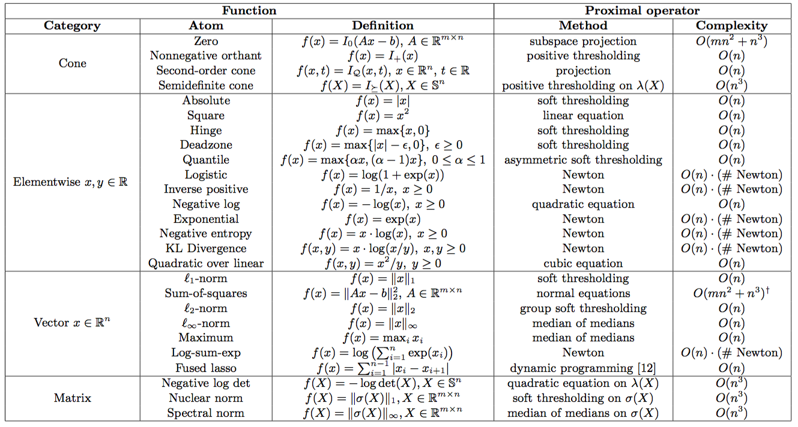

Proximal Operators
==================

The *proximal operator* forms the basic building block of Epsilon in that the
compiler reduces any convex problem into a series of proximal operator
evaluations. Mathematically, given a function :math:`f : \mathbb{R}^n \to
\mathbb{R}`, the proximal operator is defined as

.. math::
   \DeclareMathOperator*{\argmin}{argmin}
   \DeclareMathOperator{\prox}{prox}
   \prox_f(v) = \argmin_x \left( f(x) + (1/2)\|x - v\|_2^2 \right).
..

Example implementation
----------------------

In Epsilon, all proximal operators are implemented in C++ used a common
interface. As an example, the proximal operator for the :math:`\ell_2`-norm is given
by

.. math::
   \prox_{\|\cdot\|_2}(v) = \left\{  \begin{array}{cc} (1 - \lambda/\|v\|_2)v &
   \lambda \le \|v\|_2 \\ 0 & \lambda > \|v\|_2
   \end{array} \right.
..

which is implemented with the C++ code

.. code:: cpp

   class Norm2Prox final : public VectorProx {
   protected:
     void ApplyVector(
	 const VectorProxInput& input,
	 VectorProxOutput* output) override {
       const double lambda = input.lambda();
       const Eigen::VectorXd& v = input.value_vec(0);
       const double v_norm = v.norm();
       if (v_norm >= lambda) {
	 output->set_value(0, (1 - lambda/v_norm)*v);
       } else {
	 output->set_value(0, Eigen::VectorXd::Zero(v.rows()));
       }
     }
   };
   REGISTER_PROX_OPERATOR(NORM_2, Norm2Prox);

..

Supported functions
-------------------

Epsilon supports the majority of functions in the `DCP library
<http://www.cvxpy.org/en/latest/tutorial/functions/>`_ directly. In addition,
any function that is not directly supported can be reduced to conic form through
the addition of auxiliary variables.

The current list of supported functions along with their computational
complexiy is

